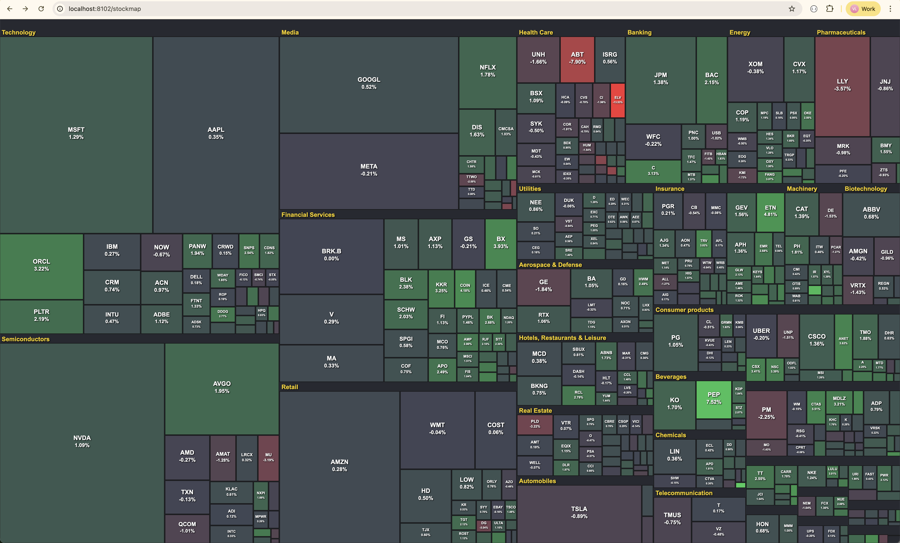
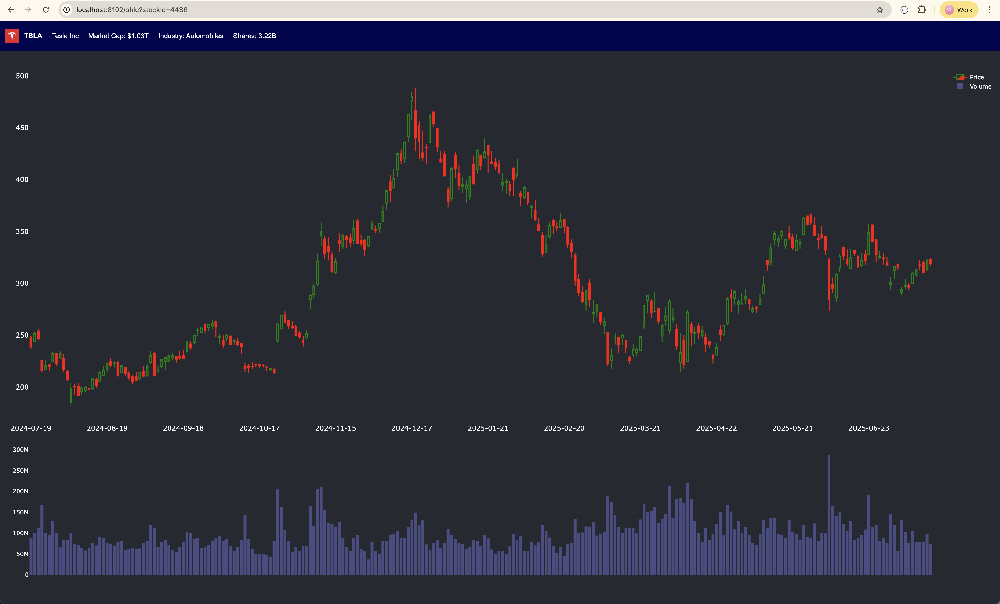
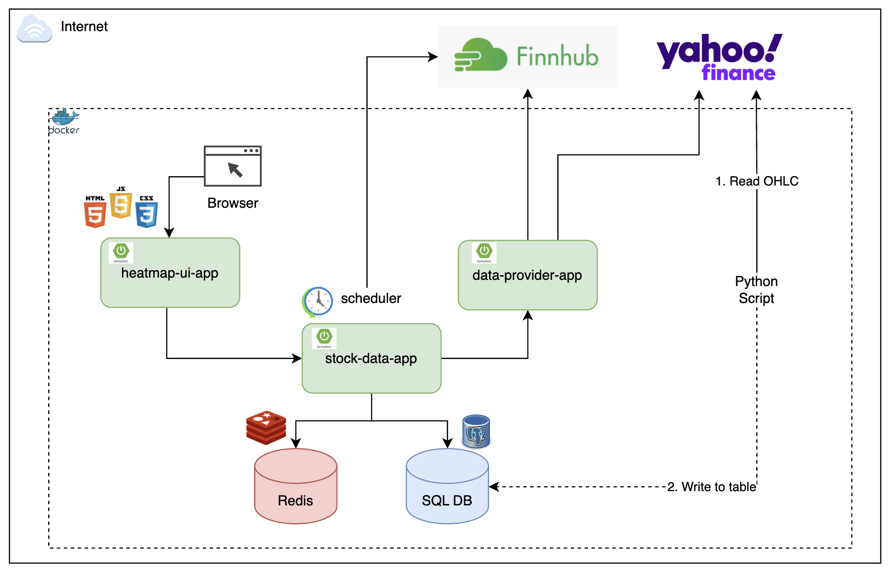
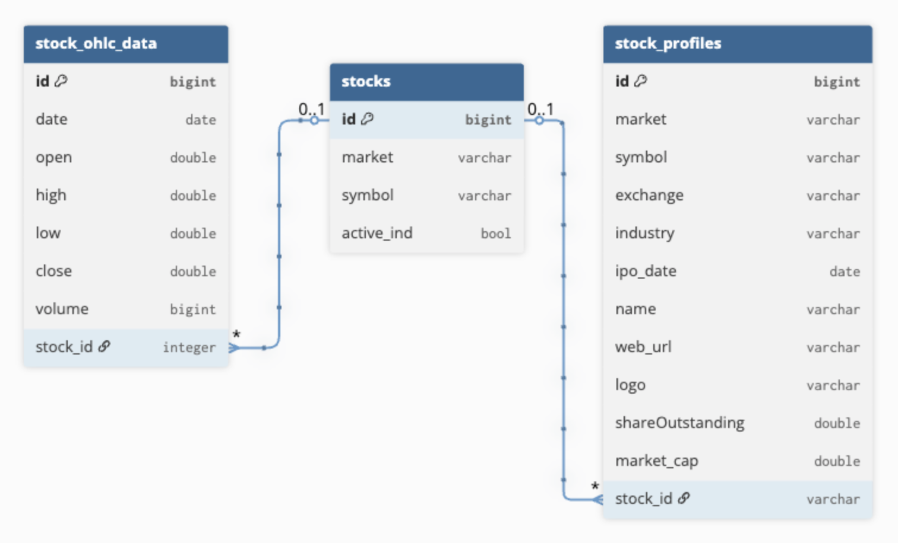

# final-project

### 1. Clone the project
- git clone git@github.com:bootcamp-final-project/stock-heatmap.git
### 2. Create Python Env
- source python_env_setup.sh
### 3. Environment Check
- Docker Deskstop is installed
### 4. Run Docker Env
- source docker_env_setup.sh (After the app is running, the tables will be created)
### 5. Run Python Setup Script (Take sometime to load ohlc and profile data)
- 1. Load All Nasdaq & NYSE Symbols
  - Run all script in "_1_load_nasdaq_symbol.ipynb"
- 2. Load S&P 500 (Stock Heatmap use S&P500 only)
  - Run all script in "_2_update_SP500.ipynb"
- 3. Load OHLC data (Update end_unix_date for latest data)
  - Run all script in "_3_full_load_ohlc_data.ipynb"
### 6. Launch Website
- http://localhost:8102/stockmap

### TODO
- Launch to AWS
- Add Redis
  - Profile Data
  - History Data (Candlestick)
- Chart Update: 
  - Add Moving Average, MACD, etc.
  - Add Weekly, Monthly
  - Add Line Chart
- Add HK Stock, Crypto Market for Heatmap
- Leverage more external API, i.e. Company News, etc.

Main Page - Stock Heatmap

Daily Candlestick per stock

Component Diagram

Entity Relationship Diagram

